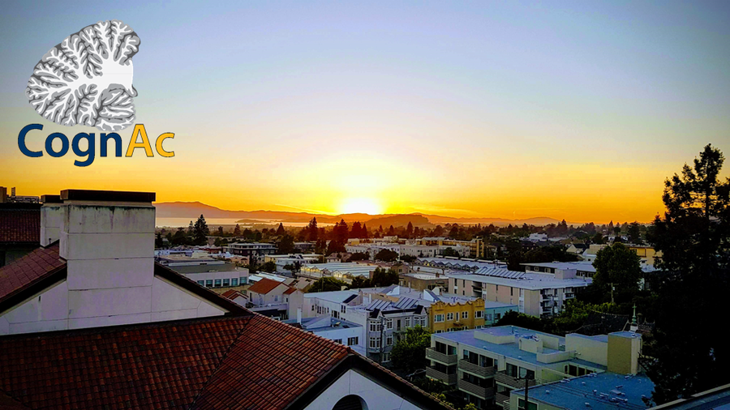

---
---

# CognAc Lab

Under the direction of Professor Richard Ivry, The
Cognition and Action Lab currently supports
several graduate, undergraduate, and post-doctoral
students. Research projects cover diverse areas of
behavior and cognition, including visual,
auditory, and time perception; language and
speech; and motor coordination.

Experiments incorporate a combination of behavioral, perceptual and cognitive tasks with both healthy participants and patient populations. Neuroimaging techniques such as functional magnetic resonance imaging (fMRI), and non-invasive brain stimulation such as transcranial magnetic stimulation (TMS) are also used. Several researchers are invovled in collaborative work with neuroscientsists and/or physicians located at other research and hospital facilities located in the United States and around the world.

<video controls width="800"
  style="float: right; margin-left: 20px;"> 
  <source src="/videos/congac_lab_promo_sep2022.mov" type="video/quicktime">
  Your browser does not support the video tag.
</video>



## Highlights



Lorem ipsum dolor sit amet, consectetur adipiscing elit, sed do eiusmod tempor incididunt ut labore et dolore magna aliqua.









Lorem ipsum dolor sit amet, consectetur adipiscing elit, sed do eiusmod tempor incididunt ut labore et dolore magna aliqua.









Lorem ipsum dolor sit amet, consectetur adipiscing elit, sed do eiusmod tempor incididunt ut labore et dolore magna aliqua.







---

If you have any questions, please send us an email to [ivrylab@berkeley.edu](mailto:ivrylab@berkeley.edu).


